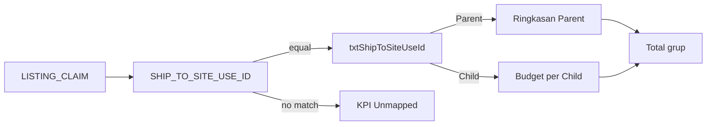

# Functional Specification Document (FSD)
## Transaction — Monitoring Claim EPM (Monitoring SubDist)

| | |
|---|---|
| **Dokumen** | FSD Transaction — Monitoring Claim EPM |
| **Produk** | Development Fund Subdist — Kalbe Nutritionals (SHP) |
| **Modul UI** | Transaction → Monitoring SubDist / Monitoring Claim EPM |
| **Versi** | **1.0** (aligned prototype ↔ MAVEN) |
| **Tanggal** | 29 Juli 2026 |
| **Sumber** | Prototype `QP Kalbe Nutritionals` + MAVEN `/DF/MonitoringSubdist` + keputusan produk ShipTo / Total grup |
| **Status** | Spesifikasi implementasi terkini |

> Halaman ini **memantau realisasi LISTING_CLAIM dari EPM** per SubDist yang sudah ter-mapping.  
> **Refresh = fetch / sync file saja** — tidak meng-apply / inject saldo DF ke BI dari layar ini.
>
> **Produksi:** ingest + UI di **MAVEN** (`Hangfire` + PostgreSQL + `/DF/MonitoringSubdist`).  
> **Prototype:** UI referensi + Claim API lokal/Vercel.  
> Lihat juga [`Claim-EPM-Sync-MAVEN.md`](./Claim-EPM-Sync-MAVEN.md), [`FSD-Master-Data.md`](./FSD-Master-Data.md), [`FSD-Inject-Delta-BI.md`](./FSD-Inject-Delta-BI.md).

---

## 1. Tujuan

1. Menampilkan ringkasan claim EPM untuk **Parent** Mapping Subdist yang match file hari ini.
2. Menampilkan **Total grup** (Parent + semua Child) serta Sebelumnya / Selisih di skala grup.
3. Menyediakan drill-down transaksi & breakdown jenis **per ShipTo** SubDist yang dibuka.
4. Menampilkan struktur Parent/Child dengan **budget masing-masing** (bukan digabung ke budget Parent).
5. Menyediakan **Refresh** untuk mengambil file LISTING_CLAIM terbaru.

---

## 1.1 Narasi modul (bahasa awam)

EPM setiap hari mengeluarkan CSV LISTING_CLAIM. Monitoring menampilkan angka file itu setelah dicocokkan ke Master Mapping Subdist lewat **ShipTo = OutletID Bosnet**.

Yang dijawab:

- Parent mana yang match file hari ini, dan berapa **total grup**-nya (Parent + anak)?
- Naik/turun dibanding file/sync sebelumnya?
- Transaksi & komposisi jenis untuk SubDist yang dibuka?
- Berapa budget masing-masing Parent/Child di grup?

**Bukan** tempat input klaim KICAO, dan **bukan** tempat inject BI.

---

## 2. Keputusan produk (kunci)

| Keputusan | Keterangan |
|-----------|------------|
| Kunci match | `SHIP_TO_SITE_USE_ID` (CSV) = `mDfMappingSubdist.txtShipToSiteUseId` = Bosnet `OutletID` |
| Ringkasan | **Parent saja** (Child tidak jadi baris sendiri) |
| Unmapped | ShipTo file tanpa mapping → KPI saja, tidak digabung ke parent |
| Budget per anggota | Parent & Child masing-masing punya budget ShipTo sendiri |
| Card/kolom **Total** | **Display rollup grup** = sum Parent + Child (bukan “menelan” budget Parent) |
| Komponen Lumpsum/EDPH/… | Tetap **own ShipTo Parent** pada baris ringkasan |
| Detail transaksi | Filter **ShipTo** SubDist yang dibuka |
| Inject BI | Grain per `kodeKmmd` / mapping (lihat FSD Inject) — di luar modul ini |

---

## 3. Ruang lingkup

### 3.1 In scope

| Fitur | Keterangan |
|-------|------------|
| Ringkasan Parent (mapped) | Satu baris per Parent yang match ShipTo |
| KPI Total / Mapped / Belum mapping | Total = sum Total grup baris Parent |
| Filter cari | Nama / Branch / Kode Branch |
| Detail: Transaksi | By ShipTo dibuka + toolbar filter tanggal/cari/export |
| Detail: Per jenis | Breakdown Lumpsum/EDPH/Promosi/EDHL (+ progress bar) |
| Detail: Child mapping | Parent + Child; Budget Monitoring per ShipTo |
| Total / Sebelumnya / Selisih grup | Summary kolom + detail KPI cards |
| Refresh | Fetch/sync file Claim EPM |
| Last update (WIB) | Timestamp sync/extract terakhir |

### 3.2 Out of scope

| Item | Keterangan |
|------|------------|
| Apply / inject delta ke BI dari Monitoring | Mutasi lewat Master / proses inject terpisah |
| API BI production | Belum di-wire dari layar ini |
| Multi-outlet per satu baris mapping | Satu mapping = satu OutletID (fase ini) |
| Menampilkan Unmapped di grid | Hanya KPI |
| Report Saldo DF production | |

---

## 4. Aktor & navigasi

| Aktor | Kebutuhan |
|-------|-----------|
| CCD / FA | Pantau selisih file; Refresh |
| CSD / RAS | Pastikan ShipTo terisi di master; pantau Unmapped |
| ABM / operasional | Drill-down klarifikasi |

| Item | Nilai |
|------|--------|
| Menu | Transaction / Development Fund → **Monitoring SubDist** |
| Prototype | `transactions/monitoring-subdist.html` |
| MAVEN | `/DF/MonitoringSubdist` |

---

## 5. Use case

### UC-MON-01 — Lihat ringkasan

1. Buka Monitoring → load summary (Claim API / `GetSummary`).
2. Match setiap ShipTo file ke mapping aktif (case-insensitive).
3. Child match **bukan** Unmapped, tapi **tidak** jadi baris ringkasan.
4. Parent match → satu baris; `Total`/`Sebelumnya`/`Selisih` = **sum grup**.
5. Komponen Rp = agregat **own ShipTo Parent**.
6. KPI: Total = sum Total grup; Mapped = jumlah baris Parent; Belum mapping = jumlah ShipTo tanpa mapping.

### UC-MON-02 — Refresh

1. User klik Refresh.
2. Prototype: `POST /api/claims/refresh` (local/Vercel).  
   MAVEN: sync Claim EPM (tolak jika status `Running`).
3. Rotasi previous ← latest; tulis latest baru.
4. UI reload summary.

### UC-MON-03 — Detail

1. Klik Detail pada Parent.
2. Load detail by `shipTo` (+ mapping id di MAVEN).
3. KPI cards: **Total grup / Sebelumnya grup / Selisih grup**.
4. Tab Transaksi & Per jenis: data **ShipTo dibuka** saja.
5. Tab Child mapping: Parent + children; budget masing-masing (`—` jika ShipTo kosong; `0` jika ShipTo ada tanpa claim).
6. Kembali ke ringkasan memulihkan KPI summary (reset tab ke Transaksi).

---

## 6. Antarmuka

### 6.1 KPI summary

| KPI | Isi |
|-----|-----|
| Total (Rp) | Sum Total grup baris Parent |
| SubDist Ter-mapping | Jumlah baris Parent di grid |
| Belum Mapping | Jumlah ShipTo file tanpa mapping |

### 6.2 KPI detail

| KPI | Label | Isi |
|-----|--------|-----|
| 1 | Total grup (Rp) | Sum budget ShipTo Parent + Child |
| 2 | Sebelumnya grup (Rp) | Sum previous per anggota grup |
| 3 | Selisih grup (Rp) | Total grup − Sebelumnya grup |

### 6.3 Tabel ringkasan

| Kolom | Keterangan |
|-------|------------|
| Aksi | Detail |
| Nama Subdist | Parent |
| Branch EPM / Kode Branch | Atribut Parent (dari file/mapping) |
| Lumpsum / EDPH / Promosi / EDHL | Own ShipTo Parent |
| Total / Sebelumnya / Selisih | **Total grup** |

### 6.4 Detail tabs

| Tab | Isi |
|-----|-----|
| Transaksi | Compact grid; filter tanggal + cari; tampilkan kode opsional; export CSV |
| Per jenis | Tabel + progress bar komposisi |
| Child mapping | Status Parent/Child; Budget Monitoring per ShipTo |

---

## 7. Aturan bisnis (BR)

| ID | Aturan |
|----|--------|
| BR-MON-01 | Ringkasan hanya **Parent** yang match ShipTo. |
| BR-MON-02 | Match: `SHIP_TO_SITE_USE_ID` = `txtShipToSiteUseId` = Bosnet `OutletID` (case-insensitive). |
| BR-MON-03 | ShipTo tanpa mapping → KPI Unmapped; tidak digabung ke Parent. |
| BR-MON-04 | Child match ShipTo → bukan Unmapped; budget di tab Child / masuk Total grup. |
| BR-MON-05 | Grain ringkasan UI = **satu baris per ShipTo Parent** (multi-branch digabung). |
| BR-MON-06 | `Total` / `Sebelumnya` / `Selisih` UI = **skala grup** Parent+Child. |
| BR-MON-07 | Lumpsum/EDPH/Promosi/EDHL di ringkasan = own Parent ShipTo. |
| BR-MON-08 | Detail transaksi & breakdown = filter ShipTo dibuka (bukan seluruh grup). |
| BR-MON-09 | Child tanpa ShipTo → budget `—`; ShipTo ada amount 0 → `0`. |
| BR-MON-10 | File/sync harian = snapshot; Sebelumnya = extract/sync sukses sebelumnya. |
| BR-MON-11 | Extract/sync pertama: Sebelumnya & Selisih = `—`. |
| BR-MON-12 | Modul **tidak** inject BI; Refresh = fetch/sync only. |
| BR-MON-13 | Last update ditampilkan **WIB**. |
| BR-MON-14 | Mapping tanpa ShipTo tidak match sampai diisi dari Bosnet LOV / backfill. |
| BR-MON-15 | Satu baris mapping = satu OutletID; multi-outlet di luar scope. |

---

## 8. Sumber data & agregasi

### 8.1 File

- Pola: `LISTING_CLAIM_ yyMMdd.csv` (delimiter tipikal `~`).
- Field amount: `RP_LUMPSUM`, `RP_EDPH_PRIN`, `RP_PROMOSI`, `RP_EDHL`.
- Kunci match: `SHIP_TO_SITE_USE_ID`.

### 8.2 Prototype

| Artefak | Path |
|---------|------|
| Latest | `Data/claims/latest.json` / Blob |
| Previous summary | `previous-summary.json` |
| API | `/api/claims/summary`, `/detail?shipTo=`, `/refresh` |
| UI | `MonitoringSubdist.js` |

### 8.3 MAVEN

| Artefak | Keterangan |
|---------|------------|
| `trClaimEpmSync` | Meta sync |
| `trClaimEpmDetail` | Baris CSV (+ `txtShipToSiteUseId`) |
| `trClaimEpmDailyBalance` | Rekap grain ShipTo (+ branch attrs); UI summary collapse per ShipTo |
| `mDfMappingSubdist.txtShipToSiteUseId` | OutletID |
| Service | `MonitoringSubdistService.GetSummaryAsync` / `GetDetailAsync` |

**Migrasi DB:** [`migrate_shipTo_all.sql`](./Script%20SQL/migrate_shipTo_all.sql).

---

## 9. Kontrak API (ringkas)

### Prototype

| Method | Path | Ket |
|--------|------|-----|
| GET | `/api/claims/summary` | Summary by ShipTo + previous |
| GET | `/api/claims/detail?shipTo=&limit=` | Detail; bila `shipTo` ada, branch/code diabaikan |
| POST | `/api/claims/refresh` | Fetch file |

### MAVEN

| Action | Ket |
|--------|-----|
| `GetSummary` | Parent rows + group totals + KPI |
| `GetDetail` | Header grup + trx/breakdown ShipTo + children budgets |
| `Refresh` | Sync Claim EPM |

---

## 10. Paritas prototype ↔ MAVEN

| Area | Status |
|------|--------|
| Parent-only summary | Sama |
| Match ShipTo | Sama (case-insensitive) |
| Total grup | Sama |
| Detail by ShipTo | Sama |
| Child budget 0 / — | Sama |
| Label Total/Sebelumnya/Selisih grup | Sama |
| Jenis bars + story naik/turun | Sama |
| Ingest | Prototype JSON API vs MAVEN Hangfire/DB |

---

## 11. Risiko & catatan operasi

1. Mapping lama tanpa ShipTo → semua Unmapped sampai diisi OutletID.
2. Satu SubdistID Bosnet bisa punya banyak OutletID — pilih baris LOV yang benar (atau backfill yang match claim).
3. Setelah ubah grain balance, **re-sync** Claim EPM.
4. Total grup di UI **bukan** berarti budget Parent “menelan” child untuk inject BI — inject tetap per mapping id (lihat FSD Inject).

---

## 12. Referensi file

| Area | Path |
|------|------|
| Prototype UI | `transactions/monitoring-subdist.html`, `js/transactions/MonitoringSubdist.js` |
| Prototype API | `api/claims/*`, `tools/claim-api/server.py` |
| MAVEN UI | `Views/DF/MonitoringSubdist/Index.cshtml`, `wwwroot/js/DF/MonitoringSubdist/MonitoringSubdist.js` |
| MAVEN service | `MAVEN.Services/DF/MonitoringSubdistService.cs` |
| Master ShipTo | `FSD-Master-Data.md`, entity `MDfMappingSubdist` |
| Sync | `Claim-EPM-Sync-MAVEN.md` |
| Inject | `FSD-Inject-Delta-BI.md` |

---

## 13. Riwayat dokumen

| Versi | Tanggal | Perubahan |
|-------|---------|-----------|
| 0.1–0.4 | Jul 2026 | Draft awal → MAVEN Monitoring; fetch-only |
| 0.5 | 29 Jul 2026 | ShipTo/OutletID; Parent & Child budget |
| 0.6 | 29 Jul 2026 | Total grup Parent+Child |
| **1.0** | **29 Jul 2026** | **Regenerate: keputusan produk final + paritas prototype↔MAVEN** |
